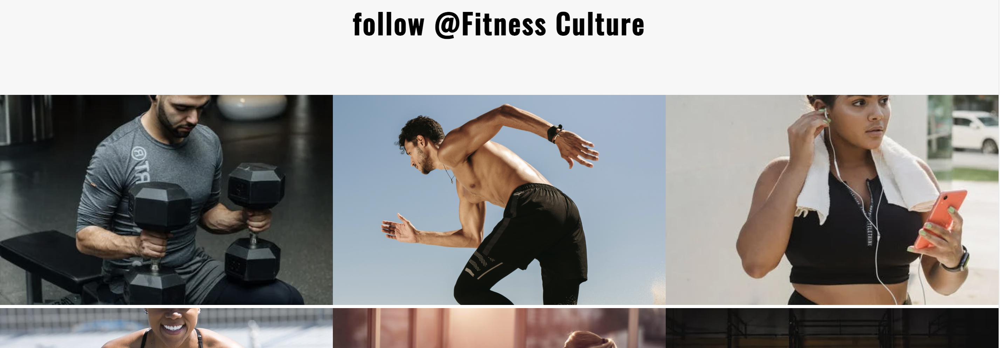
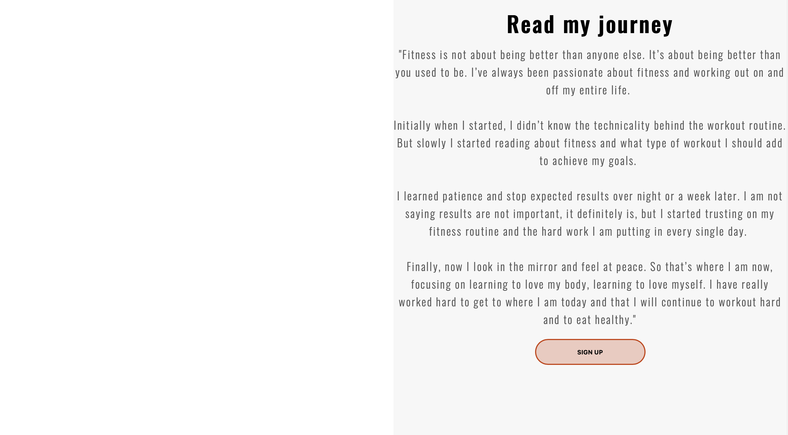

# Content

# Fitness Culture

Fitness Culture is a gym located in London that needs more customers to continue to increase monthly profits. I have created a website to help advertise Fitness Culture's gym which will help spread awareness and increase the number of monthly memberships. People that visit the website will get an detailed to insight to what they can expect if they join. The website will provide information such as; monthly membership prices, a motivational story and quote, location, meet the team section and how visitors can get in touch with Fitness Culture via a contact section.

## Features 

It's important that all pages are responsive on small, medium and large devices. Also that all pages are  
intuitively  designed to make it easy for the user to navigate.

### Home Page Features

- __Navigation Bar__

  - The navigation bar is located ontop of the background image to create a modern style navbar.

  - When the user hovers over a section, a white bar appears below to make it clear which section they are about to press.
  This is used in all pages of the website at the top for easy navigation.

- __Home Page__

  - The home page contains a large bold heading welcoming the user to Fitness Culture, this page's priority is to place the gym's name in the spotlight
  so that the user is more likely to remember Fitness Culture.

  - The background has a black gradient ontop of the image to create a larger contrast in color between the navbar and the background to make the white navbar stand out more.

- __Life Expearience section__

  - This section contains a motivational story from someone who has had the Fitness
  Culture expearience, the user will see someone's real life benefits from joining Fitness Culture which will encourage them to buy a membership.

  - An image is also used so you have visual proof as well as wriiten proof of
  the journey which will help emphersize the value of joining the gym.

- __Membership section__

  This section displays all 3 types of memberships that are offered. The prices vary a lot in order for everone viewing are able to buy one even if they have low incomes.

  - When the user hovers over a membership card, the card will display a shadow behind it, highlighting to the user which membership they are about to click.

- __The Footer__ 

  - The footer consits of three sections for medium and larger devices, a quick menu, a motivational quote and my socials.

  - The quick menu is there so that the user has easy access to all sections without having to scroll all the way up. 

  - The socials and quick menu have a black hover efftect to increase the user friendly navigation. 

  - The socials will be opened in a new tab so they not directed away from the website entirely. 

### About Us Page Features

- __Meet-the-team section__

  - The gallery will provide the user with supporting images to see what the meet ups look like. 

  - This section is valuable to the user as they will be able to easily identify the types of events the organisation puts together. 

  - This section shows pictures of the trainers and a description of what they are like and why they love their job.

- __Photo gallery section__ 

  - This page will encourage the user to visit and follow the gym's social media to help grow the brand. 

  - It contains many pictures of people working hard and having fun. 

- __Location section__ 

  - This page contains where the gym is located on google maps giving a visual representation as well as a written representation.
  Which will help the user pin point exactly where the gym is.

  - The opening times are clearly layed out, which is the rest of the important information the user needs to see about the location. 

### Features Left to Implement

- Gym facilites section, which gives a tour of the gym. And a bit about what they can expect.

## Testing 

- Below each row of images in the photo gallery section was a small white horizonatal gap.

- After research on Stackoverflow I found a fix. Giving each image a display: block; gets rid of the unwanted gap.

I visited the website on the GitHub pages link and some of the images would not load.

- After some research I was able to fix the issue by adjusting the src tag on the images. I removed the forward slash at the beginning. 

### Validator Testing 

[here](VALIDATION.md)

- HTML
  - No errors were returned when passing through the official [W3C validator](https://validator.w3.org/nu/?doc=https%3A%2F%2Fcode-institute-org.github.io%2Flove-running-2.0%2Findex.html)
- CSS
  - No errors were found when passing through the official [(Jigsaw) validator](https://jigsaw.w3.org/css-validator/validator?uri=https%3A%2F%2Fvalidator.w3.org%2Fnu%2F%3Fdoc%3Dhttps%253A%252F%252Fcode-institute-org.github.io%252Flove-running-2.0%252Findex.html&profile=css3svg&usermedium=all&warning=1&vextwarning=&lang=en#css)

### Unfixed Bugs

- I could not focus the image to the upper part of the image in the photo gallery.
- The background-position property didn't work.

## Deployment

I used GitHub pages to deploy this website. The steps are found below. 

  - First, once your logged into your GitHub account, go to your repository tab.
  - Click on the repository you are working in.
  - Press the setting tab, then click pages tab on the left hand section.
  - On the source section dropdown, select Master branch or Main branch. 
  - Then click save.
  - The page will automatically refresh when your site is successfully deployed.

The live link can be found here - https://ewicks.github.io/Gym-Website-Milestone-Project-1/

### Local Deployment

In order to make a local copy of this project, you can clone it. In your IDE Terminal, type the following command to clone my repository:

- `git clone https://github.com/Ewicks/Gym-Website-Milestone-Project-1.git`

Alternatively, if using Gitpod, you can click below to create your own workspace using this repository.

## Credits 

In this section you need to reference where you got your content, media and extra help from. It is common practice to use code from other repositories and tutorials, however, it is important to be very specific about these sources to avoid plagiarism. 

You can break the credits section up into Content and Media, depending on what you have included in your project. 

### Content 

- I used the Love Running Project to guide me through my project. 

- I used the design idea of creating a vertical line between each navbar element from the repository [here](https://github.com/johnvenkiah/CI_MS1_John_Venkiah/blob/master/index.html).

- I used a tutorial from youtube to create a hovering effect for the text in the life expearience section. The link to this video is [here](https://www.youtube.com/shorts/_1vEGYWaaQY).

- The icons in the footer were taken from [Font Awesome](https://fontawesome.com/)

### Media

- Some of the photos in the website was from a website called [pexels](https://www.pexels.com/search/fitness/)

 