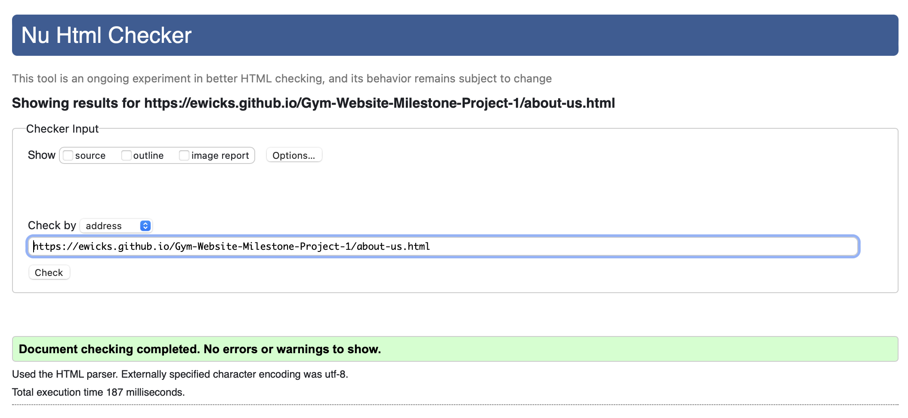
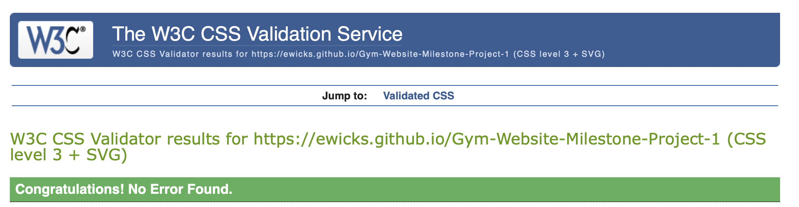

### W3C HTML Validator

## Home Page

## About Us Page

## Gym Facilities Page

## Contact us Page

## CSS Page

### Brower Compatibility 

## Chrome

I have tested my full website on Chrome and I can say that there is no compatibility issues that I can see. 

- Here is the home page in a chrome brower while in tablet mode 

- Here is the photo gallery in chrome while in mobile mode

## Safari

I have tested my wesbtite on Safari and I cannot see any comptibility issues. 

- This is the about us page in desktop mode

- This is the meet the team section in tablet mode

### Responsiveness

This website has been created for all devices that have a width larger than 375px.

## Desktop

- Here are two screenshots that are in desktop mode.

## Tablet

- Here are two screenshots that are in tablet mode.

## Mobile

- Here are two screenshots that are in mobile mode.

